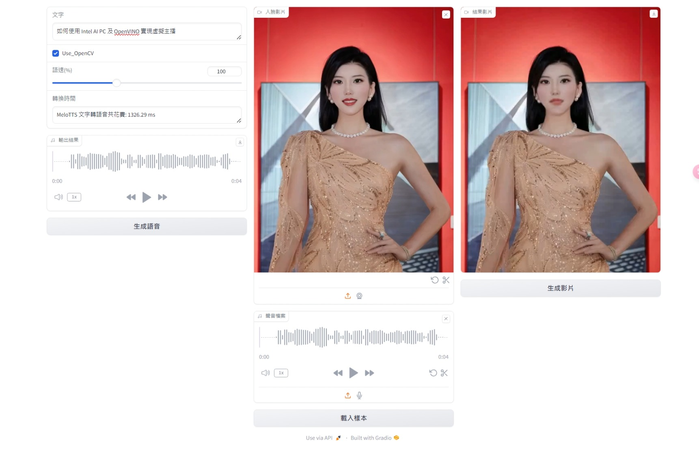

# 如何使用 Intel AI PC 及 OpenVINO 實現虛擬主播 （digital_human）
by Jack OmniXRI, 2024/12/12  

本範例整合 Intel OpenVINO 版 MeloTTS 及 Wav2Lip，完成一個文字輸入，語音輸出（女聲自動讀中英混合稿），並配上有人臉影片自動對嘴形，達成一個簡單版虛擬主播。所有操作作面採Gradio。  

本範例是基於 **Intel OpenVINO 2024.4** 及 **Notebooks 2024.5** 進行測試，主要整合下列內容：  
* 文字轉語音(Text to Speech, TTS) - MeloTTS https://github.com/zhaohb/MeloTTS-OV/tree/speech-enhancement-and-npu  
* 自動對嘴影片生成 - Wav2Lip  https://github.com/openvinotoolkit/openvino_notebooks/tree/2024.5/notebooks/wav2lip  

本範例使用 Gradio 作為操作界面，預設啟動網址為 http://127.0.0.1:7869/  (http://localhost:7869/ ，操作步驟如下：  
1. 在文字欄位輸入一段文字，調整語速（50% ~ 200%，預計100%），按下「生成語音」鍵即可透過 MeloTTS 產生一個聲音檔案，預設為 "ov_en_int8_ZH.wav"。  
2. 接著按下「載入樣本」鍵即可載入一個預設的影片(data_video_sun_5s.mp4)和剛才生成的聲音檔案。這裡亦可直接上傳影片和聲音檔案或開啟網路攝影機直接錄影、錄音再進行合成。  
3. 最後按下「生成影片」鍵即可開始使用 Wav2Lip 進行影片生成，即得一個可播放的影片，點擊影片左下方播放鍵就能檢視生成結果。  

建議影片長度要大於聲音內容長度，因為影片長度不足時會自動重頭播放，會有不連續跳動感產生。  

本範例執行前請先參考 https://github.com/OmniXRI/digital_human 安裝步驟及注意事項。如想深入了解 Gradio 可參考[【vMaker Edge AI專欄 #24】 如何使用 Gradio 快速搭建人工智慧應用圖形化人機界面](https://omnixri.blogspot.com/2024/12/vmaker-edge-ai-24-gradio.html)
